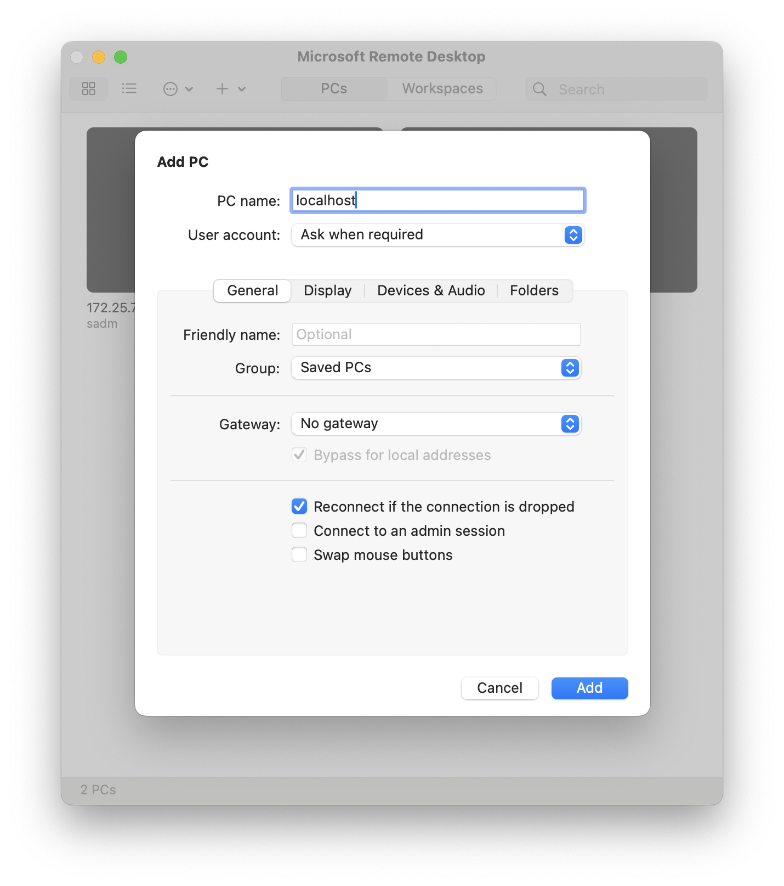

# Task 1: Setup a Virtual Machine

It is common to have problems during the setup stage.
Try to figure it out yourself first.
Remember to read the error messages carefully and search online for solutions.
The abilities to search and debug is crucial in dealing with Linux.

However, if you cannot find solutions after you try all approaches you can think of, feel free to discuss it with your classmates or email the TA.

!!! warning "Not Using an x86 Machine?"

    These assignments are designed with the assumption that you're using an x86-64 machine.
    If you don't have access to an x86-based machine, you should have already requested a server for your assignments.

    Please note that you won't have access to the graphical interface of the remote machine, so additional steps may be required.
    Refer to the relevant tabs for instructions tailored to your situation.

    === "Local Machine"

        These instructions are for students who are using their own x86 machines.

    === "Remote Server"

        These instructions are for students who are using the remote server provided by the course.

## Install VirtualBox on your machine

=== "Local Machine"

    VirtualBox is an open-source software that runs on most common platforms.
    Please download the latest version from [page](https://www.virtualbox.org/wiki/Downloads) and install it on your machine.
    It should work on all major x86-based platforms.

=== "Remote Server"

    **You'll still be working with VirtualBox.**

    For some part of the assignments, working in a virtual machine under you control is necessary, even though the server is already installed with Ubuntu.
    To do so, you should execute the following command

    ```
    sudo apt install virtualbox virtualbox-ext-pack
    ```

## Download an ISO image of Linux Ubuntu

You can download the Ubuntu 22.04 Server install image for a 64-bit machine from the provided [link](https://download.nus.edu.sg/mirror/ubuntu-releases/22.04/ubuntu-22.04.3-live-server-amd64.iso).
Alternatively, you can obtain the installation image from [Ubuntu's official website](https://ubuntu.com/download/server).

You also have the option to download the desktop version, which comes with GUI support but demands more resources.
The following instructions will presume the use of the server version.

## Create a new Virtual Machine

=== "Local Machine"

    1. Start VirtualBox
    1. Click "New" button in the Oracle VM VirtualBox Manager.
    1. Click "Expert Mode" button at the bottom.
    1. Use the setting listed below
      - Name and the Operating System
        - Name: CS5250 (or anything you like)
        - ISO Image: Choose the ISO file you downloaded
        - Type: Linux
        - Version: Ubuntu (64-bit)
        - Check "Skip Unattended Installation"
      - Hardware
        - Base Memory: 1024 MB (or larger, you can change this when needed)
        - Processors: 2 (or more, you can change this when needed)
      - Hard Disk
        - Create a virtual hard disk now.
        - Allocate at least 40 GB
    1. Click "Finish"

=== "Remote Server"

    To run VirtualBox on a remote server without a GUI environment, you will use the `VBoxManage` command to create and manage your virtual machine.
    You can then connect to it from your local machine via the Remote Desktop Protocol.

    For an overview of how to create a VM on a headless server, refer to [Section 7.1.3](https://www.virtualbox.org/manual/ch07.html#headless-vm-steps).
    Keep the following points in mind:

    - The example provided in the manual is for Windows XP, but we intend to use Linux as the Guest OS.
      Adjust the `ostype` accordingly to match your requirements.
    - When configuring your VM, choose an appropriate number of CPUs, memory size, and virtual hard disk size.
      We recommend setting it to 2 CPUs, 2 GB of memory, and 40 GB of disk space.

## Launch and Install OS for your VM

=== "Local Machine"

    Start your virtual machine by clicking "Start" in VirtualBox Manager, and install Ubuntu as guided.

=== "Remote Server"

    Ensure that you have an RDP client installed on your local machine.
    For Mac users, you can consider using "Microsoft Remote Desktop" from the App Store.

    The VRDP server that comes with VirtualBox typically uses TCP port 3389 by default.
    However, for security reasons, this port is disabled using [ufw](https://ubuntu.com/server/docs/security-firewall).
    You should use SSH port forwarding by executing the following command on your local machine:

    ```bash
    ssh -L 3389:localhost:3389 <username>@<server-ip>
    ```

    This command establishes a secure SSH tunnel, forwarding traffic from port 3389 on your local machine to the same port on the server, facilitating secure access to the VRDP server on the remote machine as if it were running locally.

    Refer to the [manual](https://www.virtualbox.org/manual/ch07.html#vboxheadless) for guidance on starting the virtual machine using the `VBoxHeadless` command with VRDE enabled.
    Once initiated, connect to the virtual machine using your RDP client.
    Since the port has been forwarded to your local machine, set the IP as either `localhost` or `127.0.0.1`.
    

    Follow the guided installation process to install Ubuntu on your virtual machine.

    Note: Mac keyboards have a different layout from the standard ANSI or ISO ones. On the "Keyboard configuration" step, you may try the "Keyboard Variant" ending with `(Macintosh)` as one option to consider.

Please take note of the following settings:

- **Profile Setup**:
  - **Name**: Enter your full name.
  - **Server's Name**: Choose a name that starts with your NUSNET ID.
  - **Username**: Choose a username that is formed from your real name.
  - **Password**: Choose a secure password.
- **SSH Setup**:
  - Ensure to check the "Install OpenSSH server" option.

## Login

After reboot, you shall see some logs doing initial setup, which is output by "cloud-init".
When it is done, press "Enter" and you should see the login prompt

```
hostname login:
```

To login, input your username, press "Enter", and then input your password as required.
And you will see the bash prompt

```
user@hostname:~$
```

As a beginner, you may try to find and print the information below.

- The OS version and the kernel release version
- The IP address allocated, and your MAC address

## Setting Up Shared Folder

A shared folder is a directory or folder that can be accessed and used by both the host machine (where VirtualBox is installed) and the guest virtual machine (VM) running within VirtualBox.
This feature allows for the seamless exchange of files between the host[^1] and the VM.
Please create a shared folder on your host machine and share it with the VM.

## Setting Up SSH Connection (Optional)

Configure the virtual machine to allow for connection via SSH from the host[^1] machine.
This will enable you to attach VSCode to the VM, providing a superior experience compared to using the terminal inside the VM.
Please note that you might need to configure VirtualBox to make the service accessible.

## Recovery (Optional)

In case you encounter an irreparable issue with the VM, simply repeat the aforementioned steps to set up a new one.
However, any work previously done will be lost.

Creating a snapshot of your virtual machine can be a lifesaver.
A snapshot captures the current state of the virtual machine, which you can revert to at any time.
This means if something goes wrong, you won't lose all your work - you can simply revert to the snapshot.
But that takes up disk space, so use it sparingly.

[^1]:
    "Host" refers to the machine where VirtualBox is installed and running.
    For instance, if you run VirtualBox locally on your Windows laptop, the "host" refers to Windows.
    If you are using a MacBook with VirtualBox installed remotely on a server, the "host" refers to the remote server rather than your MacBook.
